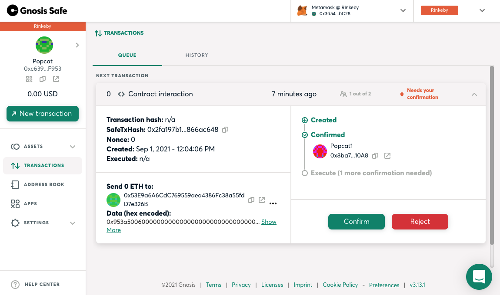

# gnosis-safe-popcat
A sample smart contract written in Solidity to record the Popcat champion. This guide demonstrates how to interact MetaMask wallet with Gnosis Safe using its web app such as creating Safes, signing transactions with multisigs, and executing the transactions on Rinkeby testnet.

### Version
- [Solidity](https://solidity.readthedocs.io/): 0.8.4
- [Gnosis Safe](https://rinkeby.gnosis-safe.io/app/): 3.12.1
- [MetaMask](https://metamask.io/): 10.0.2
- [hardhat](https://nodejs.org/en/): 2.6.1
- [ethers](https://docs.ethers.io/): 5.4.5

### Installation
Install Node.js.
```
brew install node
```

Install the required Node.js packages in this project including `hardhat` and `ethers`.
```
npm install
```

### Alchemy
1. Create an account in https://www.alchemy.com/.

2. Go to https://dashboard.alchemyapi.io/ and navigate to 'CREATE APP'.
    <br/>
    
    <br/>
    

3. Click on the Popcat app and copy the HTTP URL from 'VIEW KEY'.
    <br/>
    
    <br/>
    

### MetaMask
1. Install MetaMask extension in Chrome.

2. Create 3 accounts in the MetaMask wallet. To test on Rinkeby, you may probably need to get fake ETH for your accounts from https://faucet.rinkeby.io/.

3. Select one of the accounts that will be used to deploy the smart contract. Navigate to 'Account details' and click on 'Export Private Key'.
    <br/>
    
    <br/>
    

### Configuration
In the project root directory, create a `.env` file containing the Alchemy API URL and the private key exported from MetaMask.
```
API_URL="https://eth-rinkeby.alchemyapi.io/v2/f0cZZ7vGa7vnVettVB2paXp-psyzPfeJ"
PRIVATE_KEY="ac0974bec39a17e36ba4a6b4d278ff944bacb678cbed5efcae781d7bf4f2cf80"
```

The default network is configured to Rinkeby testnet, and the artifacts output path is set to `./gnosis-safe-dapp/src/artifacts` since the DApp needs to use the ABI in the artifacts. You can customize the configurations in `hardhat.config.js`.

### Compilation
```
npx hardhat compile
```

### Deployment
```
npx hardhat run scripts/deploy.js
```
Check if the smart contract has been successfully deployed in https://rinkeby.etherscan.io/ using the contract address.
<br/>

<br/>


### Get Started
1. Open Chrome and go to `https://rinkeby.gnosis-safe.io/app/#/welcome`.
    <br/>
    

2. Connect to MetaMask wallet.
    <br/>
    

3. Create a Safe and wait until the transaction is confirmed.
    <br/>
    
    <br/>
    
    <br/>
    
    <br/>
    
    <br/>
    
    <br/>
    

4. After the Safe is created, let's get started executing a transaction. Navigate to 'New transaction' and select 'Contract interaction'.
    <br/>
    
    <br/>
    
    
5. Fill in with the contract address and ABI which can be found in `./gnosis-safe-dapp/src/artifacts/contracts/Popcat.sol/Popcat.json`. Select 'updateChampion' in 'Method' and input a Popcat champion.
    <br/>
    
    <br/>
    

6. Sign the transaction with Account 1.
    <br/>
    

7. Switch to Account 2 in MetaMask, sign and execute the transaction.
    <br/>
    
    <br/>
    
    <br/>
    
    <br/>
    

8. You can navigate to 'HISTORY' to check the transaction history or search by the transaction hash in https://rinkeby.etherscan.io/.
    <br/>
    
    <br/>
    